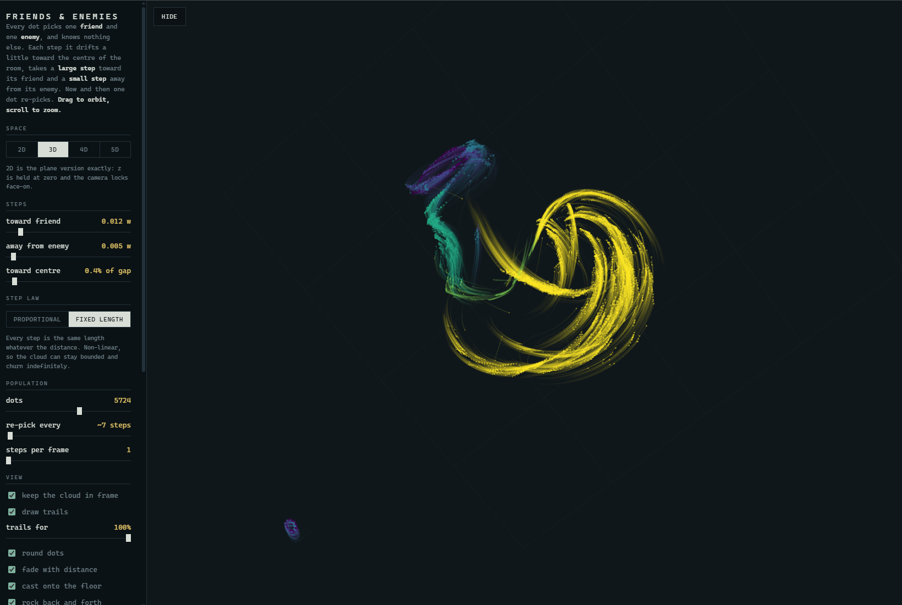

# Friends & Enemies

A real-time WebGL2 flocking simulation compiled from Rust to WebAssembly.

Each dot picks one friend and one enemy, then moves toward its friend, away from
its enemy, and slightly toward the centre. From those local relationships, the
swarm self-organises into counter-rotating rings. The physics, a
squeeze-the-camera grand tour, and per-dot projection live in a small Rust
`cdylib` exposed to JS via
[`wasm-bindgen`](https://rustwasm.github.io/wasm-bindgen/); the rAF loop, DOM
controls, and WebGL2 renderer run in plain JavaScript.

[](https://flocking.zeger.app)

https://github.com/user-attachments/assets/1980a444-c766-4fba-845c-53209e72acfa

## Stack

- **Rust** (`edition = "2021"`) — physics, camera, grand tour, RNG.
  - `wasm-bindgen`, `js-sys`, and a `web-sys` slice limited to WebGL2 +
    canvas bindings (no full `web-sys` dependency bloat).
  - Released with `opt-level = 3`, `lto = true`, `codegen-units = 1`, and
    `wasm-opt -z` for the smallest, fastest bundle.
- **JavaScript glue** (`glue.js`) — owns the rAF loop, the controls panel,
  and the WebGL2 renderer (instanced dots, trails, links, floor, fog).
- **[Trunk](https://trunkrs.dev/)** — builds the Rust crate, wires the wasm
  binding into `index.html`, and serves the app on `http://localhost:8080`.

## Prerequisites

- A recent Rust toolchain (`rustup`) with the `wasm32-unknown-unknown` target:
  ```sh
  rustup target add wasm32-unknown-unknown
  ```
- [`trunk`](https://trunkrs.dev/) for building/serving:
  ```sh
  cargo install --locked trunk
  ```
- Node.js 22 or newer and npm for the pinned Wrangler CLI used for Cloudflare
  deployment. With nvm, run `nvm use` to select the version in `.nvmrc`.
- A WebGL2-capable browser.

## Run

```sh
trunk serve            # http://localhost:8080  (hot rebuild on save)
trunk build --release # optimised dist/ for deployment
```

Open the served URL; the controls dock lives on the left of the canvas.

## Deploy to Cloudflare

The project deploys `dist/` through
[Cloudflare Workers Static Assets](https://developers.cloudflare.com/workers/static-assets/).
No Worker backend is required.

Install the deployment tooling, then create a local credential file:

```sh
nvm use
npm install
cp .env.example .env
```

Fill in `CLOUDFLARE_API_TOKEN` and `CLOUDFLARE_ACCOUNT_ID` in `.env`. Use an
API token restricted to the intended Cloudflare account; both `.env` and local
Wrangler state are gitignored. This keeps deployment isolated from other
Cloudflare accounts configured on the same WSL machine.

```sh
npm run deploy:env
```

That command loads `.env`, creates an optimised Trunk build, and runs
`wrangler deploy`. To use a custom domain, configure the `routes` section in
`wrangler.jsonc` before deploying. If the variables are already exported in
the current shell, use `npm run deploy`. To preview the production build
locally through Wrangler, use `npm run cf:dev`.

## Tour of the source

```
Cargo.toml       crate config (cdylib), web-sys feature sliver, release profile
Trunk.toml        trunk serve/build config + port
index.html        shell + controls panel; loads wasm via Trunk's rust-data-link
glue.js            rAF loop, WebGL2 renderer, DOM, palettes
src/
  lib.rs          wasm-bindgen entry — exposes `Flock` to JS, owns packed
                  positions, uniforms, colour modes, trail geometry
  sim.rs          agents, neighbourhood update, the friend/enemy rule set
  camera.rs       centroid-fit, rock/spin, tour uniforms
  tour.rs         squeeze-the-camera grand-tour rotation chain
  rng.rs          deterministic PRNG seeded from the constructor
```

## Controls

The dock on the left (see `index.html`) exposes:

- **Play/pause** and **step speed** — drive the `for _ in 0..speed { sim.step() }`
  loop in JS.
- **Dimensions** (2D → 5D) — rules run in up to 5D; the camera grand tour and
  vertex shader project the higher-dimensional state into the visible 3D view.
- **Colour modes** — friend/enemy palette, complementary ramp, cyclic, and a
  couple of single-tone themes.
- **Camera** — rock, spin, auto-fit, lens/fog toggles, manual 4D-5D chain.
- **Trails / links / floor / shadows** — drawn by the JS renderer from per-frame
  geometry produced in wasm. Trails use their complete history and are sampled
  automatically only when needed to keep the simulation responsive.

## Inspiration

Inspired by [Isaac King's Friends and Enemies simulation](https://x.com/IsaacKing314/status/2086721066106253347).

## License

MIT — see [LICENSE](./LICENSE).
